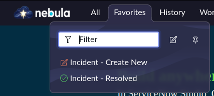
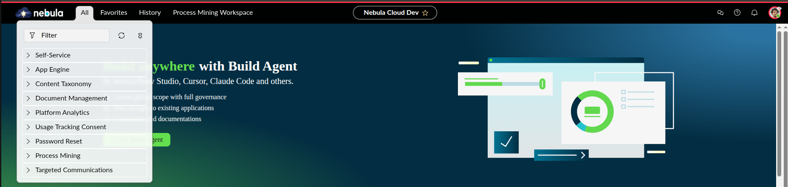

# 🟢 Lab SNAF 1.1: User Interface and Navigation

## 🏢 O Cenário (Business Case na Nebula)
A equipa de Service Desk da Nebula Cloud Dynamics está a perder tempo precioso à procura dos módulos de incidentes no meio de centenas de aplicações. Como Arquiteto, vais otimizar o tempo de resposta deles criando atalhos (Favoritos) padronizados e, de seguida, vais assumir a perspetiva de um analista nível 1 para garantir que ele só vê o que precisa de ver.

---

## 📚 Teoria de Ouro para o Exame CSA (Anota isto!)
* **Filtro do Navegador (Filter Navigator):** A barra de pesquisa pesquisa *apenas* nomes de aplicações, nomes de módulos e favoritos. **Não pesquisa registos (dados).**
* **Menus da Next Experience:** Os utilizadores navegam através dos menus **All** (Todas as apps), **Favorites** (Favoritos) e **History** (Histórico de acessos).
* **Histórico (History):** Mostra formulários e listas acedidos recentemente. *Pegadinha de prova:* **UI Pages** e outros elementos de sistema não aparecem no histórico!
* **User Impersonation (Personificação):** É a ferramenta que permite aos Administradores testar a plataforma na perspetiva de outro utilizador, sem precisarem das suas palavras-passe. Serve para testar visibilidade, segurança (roles) e UI.

---

## 🛠️ Execução na PDI (Hands-on)
Abre o teu ambiente da Nebula Cloud Dynamics e segue estes passos:

### Parte 1: Dominar os Favoritos
1. No *Application Navigator* (menu **All**), escreve a palavra `Incident`.
2. Vais ver vários módulos debaixo da aplicação "Incident". Clica no ícone de **Estrela** ao lado de `Create New` e ao lado de `Resolved`.
3. Agora, vai ao menu **Favorites** (ícone da estrela no cabeçalho).
4. No fundo do menu de favoritos, clica no ícone do lápis (*Edit Favorites*).
5. Seleciona o favorito "Create New", muda a cor para verde (sucesso) e escolhe um ícone de "mais (+)". Faz o mesmo para o "Resolved", escolhendo outra cor.

> 📸 **PRINT 1: Menu de Favoritos Customizado**
> 

---

### Parte 2: O Poder do Impersonation
1. Clica no teu Avatar/Foto de Perfil no canto superior direito do ecrã.
2. Clica em **Impersonate User**.
3. Na barra de pesquisa, procura por `Abel Tuter` (é um utilizador de testes padrão na plataforma que não tem direitos de Admin). Seleciona-o e clica em "Impersonate".
4. O ecrã vai recarregar. Clica no menu **All**.
5. Repara como o navegador agora está quase vazio! O Abel não tem a *role* de Admin, logo a plataforma esconde módulos confidenciais (segurança visual).

> 📸 **PRINT 2: Visão do Abel Tuter (Impersonation)**
> 

6. Clica novamente no avatar do Abel e seleciona **End Impersonation** para voltares a ser o System Administrator todo-poderoso da Nebula.
