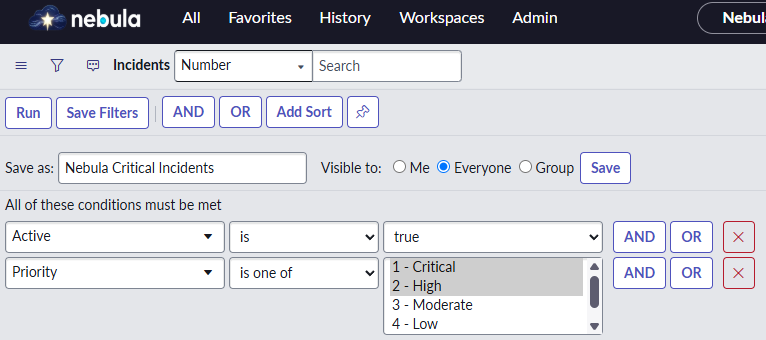
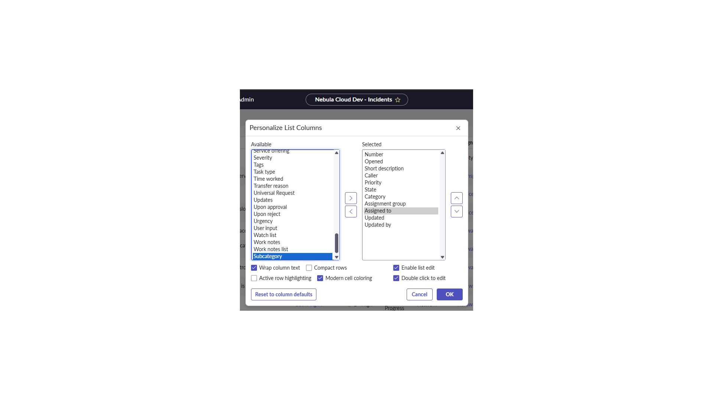
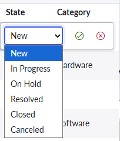
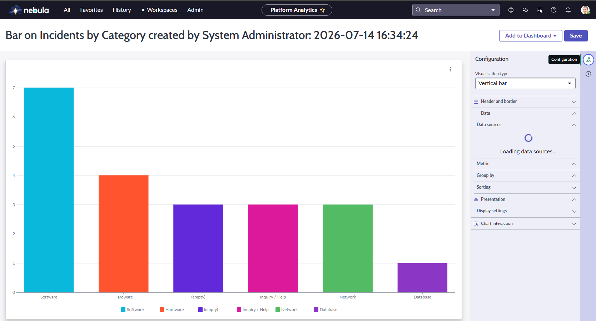

# 🔵 Lab Nebula 2.1: Lists and Filters Optimization

## 🏢 O Cenário (Business Case na Nebula)
Os gestores da Nebula Cloud Dynamics estavam a perder tempo diariamente a recriar filtros manuais para visualizar incidentes críticos. Além disso, a visão de lista padrão continha colunas irrelevantes para os coordenadores de plantão. A tua missão como Arquiteto é aplicar a governação de filtros e treinar a equipa no uso de personalização e relatórios instantâneos.

---

## 📚 Teoria de Ouro para o Exame CSA (Anota isto!)
* **A Regra FOV (Condition Builder):** A ordem estrutural para a criação de um filtro é estrita: **F**ield -> **O**perator -> **V**alue (Ex: `State` -> `is` -> `In Progress`).
* **Column Context Menu vs. List Context Menu:** O clique direito no cabeçalho da coluna permite gerar relatórios rápidos (Bar Chart) e agrupar dados. O clique direito numa linha permite ações sobre aquele registo.
* **List Layout vs. Personalized List:** O *List Layout* afeta todos os utilizadores (Instance Configuration). A *Personalized List* (ícone de engrenagem) afeta apenas o próprio utilizador e é guardada na tabela `sys_user_preference` (User Personalization).
* **Partilha de Filtros:** Não existe botão "Make Active". Para partilhar um filtro usa-se a sequência: Assign a Name -> Set Visibility (Everyone/Group) -> Save.

---

## 🛠️ Execução na PDI (Hands-on)
Abre o teu ambiente da Nebula Cloud Dynamics e segue estes passos:

### Parte 1: Construção e Partilha de Filtros (Condition Builder)
1. Vai a `Incident > All`.
2. Clica no ícone de funil (*Show / hide filter*).
3. Cria a condição: `[Active] [is] [true]` AND `[Priority] [is one of] [1 - Critical, 2 - High]`.
4. Clica em **Save...**. Dá o nome `Nebula Critical Incidents`. Em *Visible to*, seleciona **Everyone**.

> 📸 **PRINT 1: Condition Builder e Filtro Partilhado**
> 
> 

### Parte 2: User Personalization (Ajustando a Visão)
1. Ainda na lista de incidentes, clica no ícone de **Engrenagem** (*Personalize List*) no canto superior esquerdo.
2. Remove o campo `Subcategory` da caixa da direita para a esquerda e adiciona o campo `Assigned to` da esquerda para a direita. Clica em OK.
3. Repara que a engrenagem agora tem uma marcação a indicar que a lista foi personalizada para o teu utilizador.

> 📸 **PRINT 2: Lista Personalizada Ativa**
> 
> 

### Parte 3: Edição em Massa e Relatórios Instantâneos
1. Dá um duplo-clique na célula da coluna `State` de qualquer incidente ativo para abrires o *List Editor*.
2. Cancele a edição. 
3. Clica com o botão direito no título da coluna `Category` e seleciona **Bar Chart**.

> 📸 **PRINT 3: List Editor em Ação**
> 
> 

> 📸 **PRINT 4: Gráfico de Barras via Context Menu**
> 
> 
