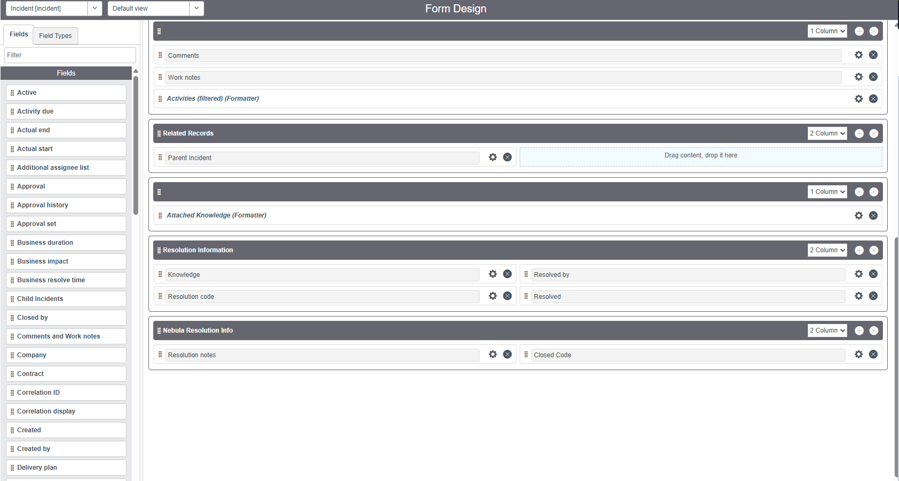
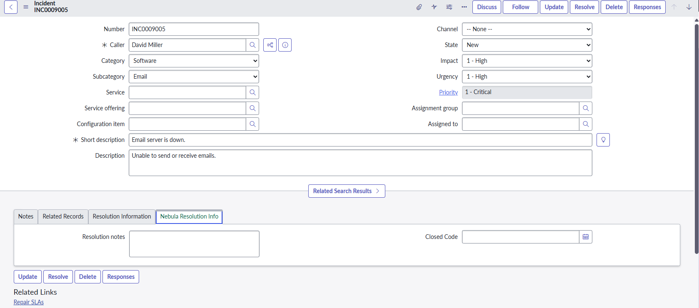
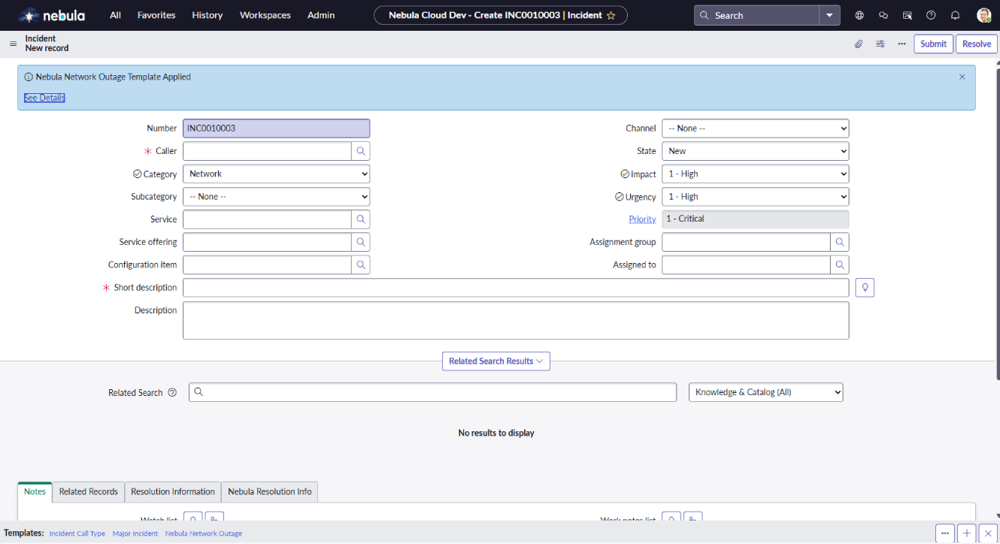

# 🔵 Lab Nebula 2.2: Form Design and Layout

## 🏢 O Cenário Corporativo (Business Case)
A equipa de Service Desk da **Nebula Cloud Dynamics** reportou que o formulário de Incidentes estava confuso. Os campos de resolução do ticket estavam misturados com os dados do cliente, causando erros e aumentando o Tempo Médio de Resolução (MTTR). Além disso, incidentes de queda de rede (Network Outages) estavam a ser preenchidos manualmente com muita lentidão. 

A minha missão foi aplicar o **Form Designer** para organizar arquiteturalmente a interface e implementar **Templates** para automação de preenchimento.

## 🛠️ Execução e Evidências Práticas

### 1. Reestruturação com o Form Designer
A arquitetura exigia a criação de uma nova área (Section) com estrutura de 2 colunas. Esta tarefa é exclusiva do **Form Designer** (o *Form Layout* clássico não cria colunas). Criamos a secção "Nebula Resolution Info" para isolar visualmente os campos de fecho do ticket.

> 📸 **Evidência 01: Manipulação visual no Form Designer**
> 
> 

> 📸 **Evidência 02: Formulário em Produção (Resultado)**
> 
> 

### 2. Automação de Entrada de Dados (Templates)
Em vez de depender de Client Scripts complexos para cenários comuns, aplicamos um **Template** nativo. O template "Nebula Network Outage" foi configurado para injetar automaticamente Categoria, Prioridade e Impacto, eliminando o erro humano em momentos de crise (P1).

> 📸 **Evidência 03: Aplicação instantânea do Template**
> *(Observe a notificação azul provando que o ServiceNow executou o preenchimento dos campos via Template Bar)*
> 
> 
